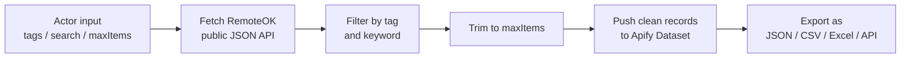

# RemoteOK Job Leads & Alerts: Recruiter Outreach, JSON/CSV Export

**RemoteOK Job Leads & Alerts** pulls live remote job listings straight from RemoteOK's public job board and turns them into clean, structured leads (job title, company, tags, salary range, location, and apply link), ready to export as JSON, CSV, or Excel, or push into Google Sheets, Airtable, or your own database via API.

No login required. No proxies used. No browser automation: just a fast, reliable call to RemoteOK's own job feed, filtered the way you need it.

## What does this Actor do?

- Fetches the current list of remote job postings from RemoteOK
- Filters by **tag** (e.g. `javascript`, `design`, `marketing`, `sales`) and/or a **keyword** search across title, company, and description
- Caps results with a configurable `maxItems` limit
- Outputs one clean record per job: position, company, tags, location, salary range, description, and both the listing URL and apply URL

## Who this is for

- **Job boards & aggregators** pulling in fresh remote listings without building their own scraper
- **Recruiters & sourcers** building keyword-filtered candidate outreach lists
- **Job seekers & indie devs** building a personal alert bot ("notify me when a new `python` + `remote` job appears")
- **Market researchers** tracking hiring trends by tag, company, or salary band over time

## How it works



## Input parameters

| Parameter | Type | Description | Default |
|---|---|---|---|
| `tags` | array of strings | Keep only jobs matching at least one of these RemoteOK tags | `[]` (all tags) |
| `search` | string | Keep only jobs where the title, company, or description contains this keyword | `""` (no filter) |
| `maxItems` | integer | Maximum number of job listings to return | `100` |

## Example output

```json
{
  "id": "1136242",
  "position": "Senior Backend Engineer",
  "company": "Example Co",
  "tags": ["dev", "backend", "remote"],
  "location": "Worldwide",
  "salaryMin": 90000,
  "salaryMax": 130000,
  "url": "https://remoteok.com/remote-jobs/...",
  "applyUrl": "https://remoteok.com/remote-jobs/...",
  "datePosted": "2026-08-05T12:26:06+00:00"
}
```

## How to run it

1. Click **Try for free** (or **Run**) on this Actor's page.
2. Optionally set `tags` and/or `search` to narrow results, and `maxItems` to cap the dataset size.
3. Click **Start** and wait for the run to finish: it takes seconds.
4. Export the results from the **Dataset** tab as JSON, CSV, Excel, or connect it to Google Sheets/Airtable, or pull it programmatically via the [Apify API](https://docs.apify.com/api/v2).

## FAQ

**Does this Actor use proxies?**
No. It calls RemoteOK's own public job feed directly, so there's nothing to route through a proxy and no added proxy cost.

**Do I need a RemoteOK account or API key?**
No login or API key is required: the feed is public.

**How fresh is the data?**
As fresh as RemoteOK's own listings page: every run fetches the current feed at run time.

**Can I filter by multiple tags at once?**
Yes: pass an array of tags and the Actor keeps any job matching at least one of them.

**Can I schedule this to run automatically?**
Yes: use Apify's built-in [Scheduler](https://docs.apify.com/platform/schedules) to run it daily/hourly and feed a job alert bot, spreadsheet, or dashboard.

## Related products

- [Company Hiring Tracker](https://github.com/timmKal01/company-hiring-tracker): track a specific company's own Greenhouse/Lever board instead of an aggregator feed
- [Company Buying Signal Report](https://github.com/timmKal01/company-buying-signal-report): turn a company's hiring activity into a scored buying signal, plus contact info
